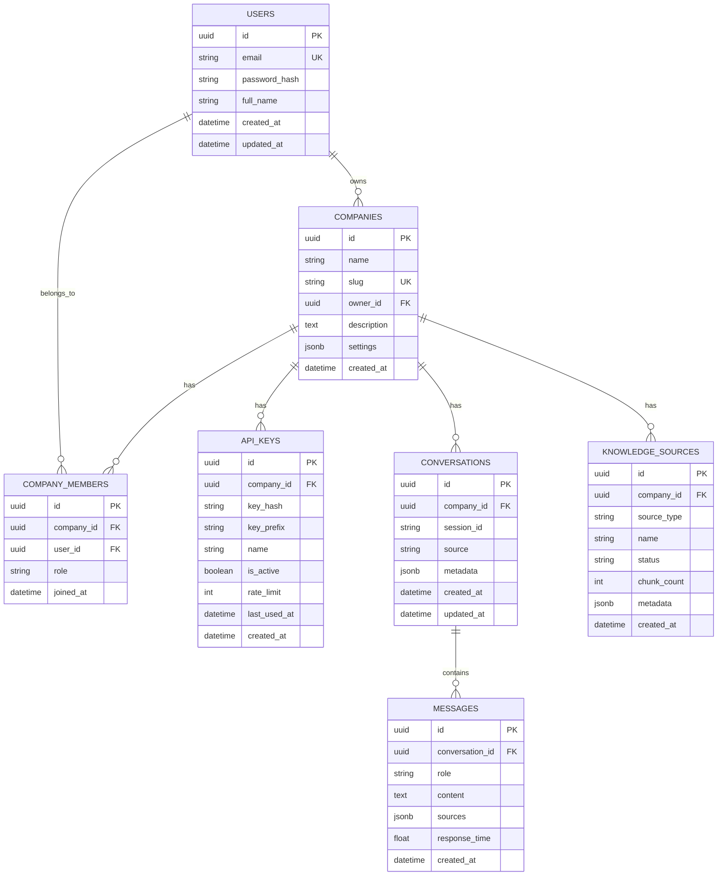

# 🚀 RAONE – AI Chatbot SaaS Platform – Implementation Plan

## Overview

Build a **multi-tenant SaaS AI chatbot platform** from scratch in the workspace at `c:\Users\susha\OneDrive\Desktop\Resume Level Project\Your Personal Transformer`. The platform enables companies to create, train, and deploy RAG-based AI chatbots via a dashboard, public API, and embeddable widget.

---

## User Review Required

> [!IMPORTANT]
> **OpenAI API Key**: The RAG pipeline and chat service require an OpenAI API key (for embeddings + LLM). You'll need to provide a key in a `.env` file. Alternatively, I can wire it up for a local/open-source LLM — let me know your preference.

> [!IMPORTANT]
> **PostgreSQL**: The backend requires a running PostgreSQL instance. Please confirm:
> 1. Do you have PostgreSQL installed locally, or should I use SQLite for initial development?
> 2. If PostgreSQL, what are your connection details (host, port, db name, user, password)?

> [!WARNING]
> **Tailwind CSS Version**: You've requested Tailwind CSS. The latest is v4 with the new `@tailwindcss/vite` plugin approach. I'll use **Tailwind CSS v4** with the Vite plugin. Confirm if you want v3 instead.

> [!IMPORTANT]
> **Scope Management**: This is an extremely large project (~50+ files, full-stack). I propose building it in **5 sequential phases**, each producing a working increment. After each phase, we can verify before moving on.

---

## Project Structure

```
Your Personal Transformer/
├── frontend/                    # React + Vite + Tailwind
│   ├── public/
│   ├── src/
│   │   ├── assets/
│   │   ├── components/
│   │   │   ├── landing/         # Landing page sections
│   │   │   ├── dashboard/       # Dashboard components
│   │   │   ├── chat/            # Chat UI components
│   │   │   ├── auth/            # Auth forms
│   │   │   ├── widget/          # Embed widget
│   │   │   └── ui/              # Shared UI primitives
│   │   ├── pages/
│   │   │   ├── LandingPage.jsx
│   │   │   ├── LoginPage.jsx
│   │   │   ├── SignupPage.jsx
│   │   │   ├── DashboardPage.jsx
│   │   │   ├── KnowledgeBasePage.jsx
│   │   │   ├── ApiKeysPage.jsx
│   │   │   ├── ChatPage.jsx
│   │   │   └── AnalyticsPage.jsx
│   │   ├── hooks/
│   │   ├── services/            # API client functions
│   │   ├── stores/              # Zustand state stores
│   │   ├── App.jsx
│   │   ├── main.jsx
│   │   └── index.css
│   ├── index.html
│   ├── vite.config.js
│   ├── package.json
│   └── tailwind.config.js
│
├── backend/
│   ├── app/
│   │   ├── __init__.py
│   │   ├── main.py              # FastAPI app entry
│   │   ├── config.py            # Settings & env vars
│   │   ├── database.py          # SQLAlchemy setup
│   │   ├── models/              # SQLAlchemy models
│   │   │   ├── __init__.py
│   │   │   ├── user.py
│   │   │   ├── company.py
│   │   │   ├── api_key.py
│   │   │   ├── conversation.py
│   │   │   └── message.py
│   │   ├── schemas/             # Pydantic schemas
│   │   │   ├── __init__.py
│   │   │   ├── auth.py
│   │   │   ├── company.py
│   │   │   ├── chat.py
│   │   │   └── knowledge.py
│   │   ├── routers/             # API route handlers
│   │   │   ├── __init__.py
│   │   │   ├── auth.py
│   │   │   ├── company.py
│   │   │   ├── chat.py
│   │   │   ├── knowledge.py
│   │   │   ├── api_keys.py
│   │   │   └── public_chat.py
│   │   ├── services/            # Business logic
│   │   │   ├── __init__.py
│   │   │   ├── auth_service.py
│   │   │   ├── chat_service.py
│   │   │   ├── knowledge_service.py
│   │   │   ├── api_key_service.py
│   │   │   └── embedding_service.py
│   │   ├── agents/              # Agentic AI layer
│   │   │   ├── __init__.py
│   │   │   ├── retrieval_agent.py
│   │   │   ├── answer_agent.py
│   │   │   └── memory_agent.py
│   │   ├── rag/                 # RAG pipeline
│   │   │   ├── __init__.py
│   │   │   ├── embeddings.py
│   │   │   ├── vector_store.py
│   │   │   ├── chunker.py
│   │   │   ├── ingestion.py
│   │   │   ├── retriever.py
│   │   │   ├── reranker.py
│   │   │   └── query_reformulator.py
│   │   ├── middleware/
│   │   │   ├── __init__.py
│   │   │   ├── auth_middleware.py
│   │   │   └── rate_limiter.py
│   │   └── utils/
│   │       ├── __init__.py
│   │       ├── hashing.py
│   │       └── text_processing.py
│   ├── data/
│   │   └── faiss_indices/       # FAISS index storage per company
│   ├── uploads/                 # Uploaded files temp storage
│   ├── requirements.txt
│   ├── alembic.ini
│   └── alembic/                 # DB migrations
│
├── widget/                      # Standalone embed widget
│   ├── raone-widget.js
│   └── raone-widget.css
│
├── .env.example
├── .gitignore
├── docker-compose.yml
└── README.md
```

---

## Database Schema



---

## Proposed Changes — Phased Execution

---

### Phase 1: Foundation (Frontend Scaffold + Backend Core + Auth)

**Goal**: Working frontend shell + backend with auth system + database setup.

---

#### Frontend Setup

##### [NEW] `frontend/` — Vite + React + Tailwind v4

- Scaffold with `npx -y create-vite@latest ./ --template react`
- Install: `tailwindcss @tailwindcss/vite framer-motion react-router-dom zustand axios react-icons lucide-react`
- Configure Tailwind v4 via Vite plugin
- Set up routing with React Router v6
- Build design system: dark theme, glassmorphism utilities, gradient tokens
- Create shared UI components: Button, Input, Card, Modal, Sidebar

##### [NEW] Auth Pages

- `LoginPage.jsx` — email/password login with animated form
- `SignupPage.jsx` — registration with company creation step
- Auth context/store with Zustand for JWT token management
- Protected route wrapper

---

#### Backend Setup

##### [NEW] `backend/app/main.py` — FastAPI Application

- CORS middleware configured for frontend
- Router registration
- Startup/shutdown events for DB + FAISS

##### [NEW] `backend/app/config.py` — Settings

- Pydantic Settings with `.env` loading
- Database URL, OpenAI key, JWT secret, FAISS path

##### [NEW] `backend/app/database.py` — SQLAlchemy Async Setup

- AsyncSession with PostgreSQL (or SQLite fallback)
- Base model, session dependency

##### [NEW] `backend/app/models/` — All SQLAlchemy Models

- User, Company, CompanyMember, ApiKey, Conversation, Message, KnowledgeSource

##### [NEW] `backend/app/routers/auth.py` — Auth Endpoints

- `POST /auth/signup` — create user + company
- `POST /auth/login` — JWT token response
- `GET /auth/me` — current user profile

##### [NEW] `backend/app/services/auth_service.py` — Auth Logic

- Password hashing (bcrypt)
- JWT creation/validation
- User/company CRUD

---

### Phase 2: Core Platform (RAG Pipeline + Knowledge Base + API Keys)

**Goal**: Full RAG pipeline, knowledge base ingestion, API key management.

---

#### RAG Pipeline

##### [NEW] `backend/app/rag/embeddings.py`

- OpenAI `text-embedding-3-small` wrapper
- Batch embedding support
- Embedding cache

##### [NEW] `backend/app/rag/vector_store.py`

- FAISS index manager with per-company namespaces
- Add/search/delete operations
- Index persistence to disk

##### [NEW] `backend/app/rag/chunker.py`

- Recursive text splitter (500 tokens, 50 overlap)
- Sentence-aware splitting
- Metadata preservation per chunk

##### [NEW] `backend/app/rag/ingestion.py`

- PDF parsing (PyPDF2)
- DOCX parsing (python-docx)
- TXT parsing
- URL scraping (BeautifulSoup)
- Text cleaning pipeline

##### [NEW] `backend/app/rag/retriever.py`

- Hybrid search: Dense (FAISS) + BM25 (rank-bm25)
- Top-K result fusion
- Score normalization

##### [NEW] `backend/app/rag/reranker.py`

- Cross-encoder reranking (sentence-transformers)
- Score threshold filtering

##### [NEW] `backend/app/rag/query_reformulator.py`

- LLM-based query expansion
- Multi-query generation for better recall

---

#### Knowledge Base

##### [NEW] `backend/app/routers/knowledge.py`

- `POST /knowledge/upload` — file upload endpoint
- `POST /knowledge/scrape` — URL scraping endpoint
- `POST /knowledge/text` — manual text input
- `GET /knowledge/sources` — list knowledge sources
- `DELETE /knowledge/sources/{id}` — remove source

##### [NEW] `backend/app/services/knowledge_service.py`

- Orchestrate ingestion pipeline
- Background task processing
- Status tracking per source

---

#### API Key Management

##### [NEW] `backend/app/routers/api_keys.py`

- `POST /api-keys` — generate new key
- `GET /api-keys` — list keys (showing prefix only)
- `DELETE /api-keys/{id}` — revoke key

##### [NEW] `backend/app/services/api_key_service.py`

- Key generation (secrets.token_urlsafe)
- Key hashing (SHA-256)
- Key validation

---

### Phase 3: Dashboard & Chat UI

**Goal**: Company dashboard with all management features + ChatGPT-like chat interface.

---

#### Dashboard

##### [NEW] `frontend/src/pages/DashboardPage.jsx`

- Overview cards: total conversations, active API keys, knowledge sources
- Recent activity feed
- Quick actions

##### [NEW] `frontend/src/pages/KnowledgeBasePage.jsx`

- File upload dropzone (drag & drop)
- URL input form
- Manual text editor
- Source list with status indicators
- Delete/re-process actions

##### [NEW] `frontend/src/pages/ApiKeysPage.jsx`

- Generate new key (shown once, then hidden)
- Key list with name, prefix, created date, last used
- Copy & revoke actions

##### [NEW] `frontend/src/pages/AnalyticsPage.jsx`

- Chat volume chart (last 30 days)
- Popular queries
- Response time metrics
- Source hit rates

##### [NEW] `frontend/src/components/dashboard/Sidebar.jsx`

- Navigation: Dashboard, Chat, Knowledge, API Keys, Analytics, Settings
- Company switcher
- User menu

---

#### Chat UI

##### [NEW] `frontend/src/pages/ChatPage.jsx`

- ChatGPT-like interface
- Conversation list sidebar
- Message bubbles with typing indicator
- Source citations on responses
- New conversation button

##### [NEW] `frontend/src/components/chat/ChatMessage.jsx`

- User/assistant message styling
- Markdown rendering
- Code block highlighting
- Source accordion

##### [NEW] `backend/app/routers/chat.py`

- `POST /chat` — send message (authenticated)
- `GET /chat/conversations` — list conversations
- `GET /chat/conversations/{id}/messages` — get messages

##### [NEW] `backend/app/services/chat_service.py`

- Orchestrate RAG pipeline
- Context window management (last N messages)
- Citation extraction
- Response streaming (SSE)

---

#### Agentic AI Layer

##### [NEW] `backend/app/agents/retrieval_agent.py`

- Takes reformulated query → runs hybrid search → returns ranked chunks

##### [NEW] `backend/app/agents/answer_agent.py`

- Takes context + query → generates LLM response with citations

##### [NEW] `backend/app/agents/memory_agent.py`

- Manages conversation memory
- Extracts key information for context
- Stores/retrieves from PostgreSQL

---

### Phase 4: Public API & Embed Widget

**Goal**: Public chat endpoint for API integration + embeddable widget.

---

#### Public Chat API

##### [NEW] `backend/app/routers/public_chat.py`

- `POST /v1/chat` — public endpoint
- API key authentication via `Authorization: Bearer <key>` header
- Rate limiting per key
- Request/response logging

##### [NEW] `backend/app/middleware/rate_limiter.py`

- Token bucket algorithm
- Per-key rate limits (configurable in api_keys table)
- 429 response with Retry-After header

---

#### Embed Widget

##### [NEW] `widget/raone-widget.js`

- Self-contained JavaScript widget
- Creates floating chat bubble in bottom-right
- Expandable chat window
- Communicates with public API
- Configurable: API key, theme, position
- Zero dependencies

##### [NEW] `widget/raone-widget.css`

- Isolated styles (scoped to widget container)
- Dark/light theme support
- Responsive design

##### [NEW] Widget Integration Page

- `frontend/src/pages/WidgetPage.jsx`
- Shows embed code snippet
- Live preview
- Customization options

---

### Phase 5: Landing Page & Final Polish

**Goal**: Stunning landing page + overall polish, animations, and final integration.

---

#### Landing Page

##### [NEW] `frontend/src/pages/LandingPage.jsx`

- **Hero Section**: Bold tagline, animated gradient mesh background, floating particles, CTA button with glow effect
- **Features Section**: 4 feature cards with glassmorphism, hover animations, icon illustrations
- **How It Works**: 3-step animated timeline with connection lines
- **Demo Section**: Interactive embedded chatbot preview (live demo)
- **Pricing Section**: 3-tier pricing cards (Free/Pro/Enterprise) with feature comparison
- **Footer**: Links, social icons, newsletter signup

##### [NEW] `frontend/src/components/landing/Hero.jsx`

- Animated gradient background (CSS keyframes + Framer Motion)
- Typing animation for tagline
- 3D floating elements
- Responsive layout

##### [NEW] `frontend/src/components/landing/Features.jsx`

- Glassmorphism cards with backdrop-filter
- Staggered entrance animations
- Icon + title + description layout

##### [NEW] `frontend/src/components/landing/HowItWorks.jsx`

- Vertical/horizontal timeline
- Step numbers with glow
- Scroll-triggered animations

##### [NEW] `frontend/src/components/landing/Demo.jsx`

- Embedded chat window with mock responses
- Auto-play demo conversation
- "Try it yourself" mode

##### [NEW] `frontend/src/components/landing/Pricing.jsx`

- 3-column pricing grid
- Highlighted "Pro" plan
- Animated hover effects
- Feature checkmarks

##### [NEW] `frontend/src/components/landing/Footer.jsx`

- Multi-column link layout
- Social media icons
- Copyright + legal links

---

#### Design System

- **Colors**: Deep navy (#0a0f1e) → electric blue (#3b82f6) → cyan (#06b6d4) gradient palette
- **Glassmorphism**: `backdrop-blur-xl bg-white/5 border border-white/10`
- **Typography**: Inter font (Google Fonts), system fallbacks
- **Animations**: Framer Motion for page transitions, scroll reveals, hover states
- **Dark Theme**: Primary throughout, with subtle glow effects

---

## Open Questions

> [!IMPORTANT]
> 1. **Database**: PostgreSQL or SQLite for initial development? PostgreSQL is recommended for production but requires local setup.
> 2. **OpenAI Key**: Do you have an OpenAI API key ready, or should I set up a mock/open-source LLM fallback?
> 3. **Deployment**: Any preference for deployment target (Vercel + Railway, Docker, etc.)?
> 4. **Phase Priority**: Should I start with Phase 1 + Phase 5 (foundation + landing page) to get a visual demo quickly, or go strictly Phase 1 → 2 → 3 → 4 → 5?

---

## Verification Plan

### Automated Tests

#### Phase 1
```bash
# Backend
cd backend && pip install -r requirements.txt
uvicorn app.main:app --reload  # Verify startup
# Test auth endpoints with curl/httpie

# Frontend
cd frontend && npm install && npm run dev
# Verify landing page renders at localhost:5173
```

#### Phase 2
```bash
# Test RAG pipeline
python -m pytest backend/tests/test_rag.py
# Test knowledge ingestion with sample PDF/URL
curl -X POST http://localhost:8000/knowledge/upload -F "file=@sample.pdf"
```

#### Phase 3-5
- Browser subagent testing for all UI pages
- API endpoint testing with curl
- Widget embed testing in a test HTML page

### Manual Verification

- Visual review of landing page (screenshot comparison)
- End-to-end flow: signup → create company → upload document → chat with AI → get response with citations
- Public API test: generate key → call chat endpoint → verify response
- Widget: embed in test HTML → verify floating chat works
